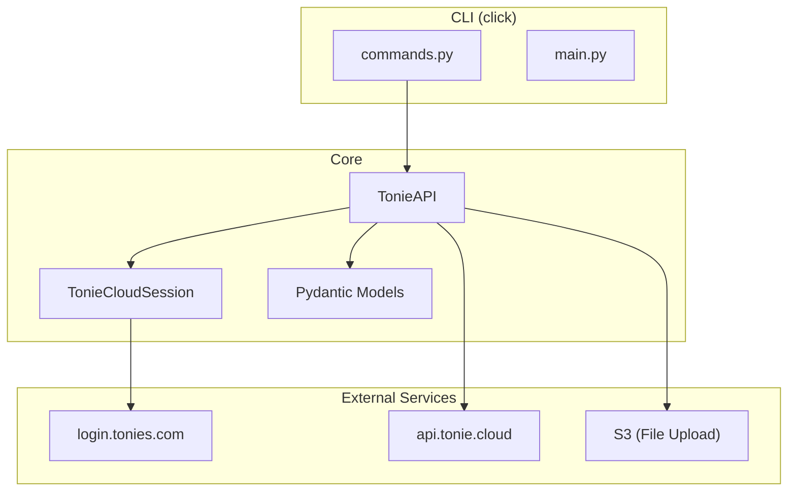
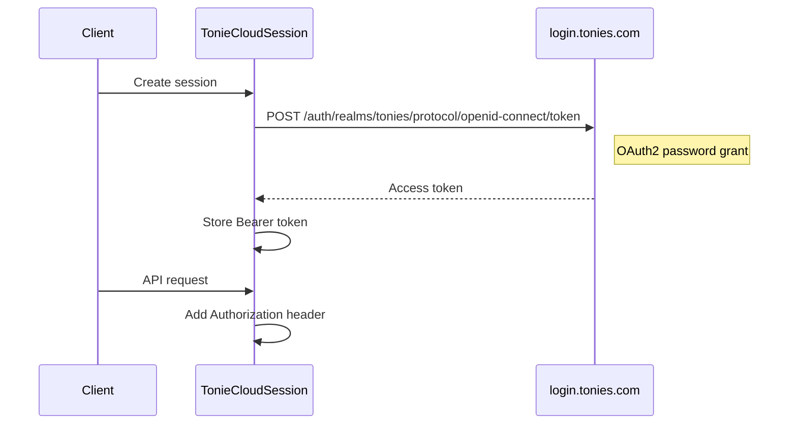
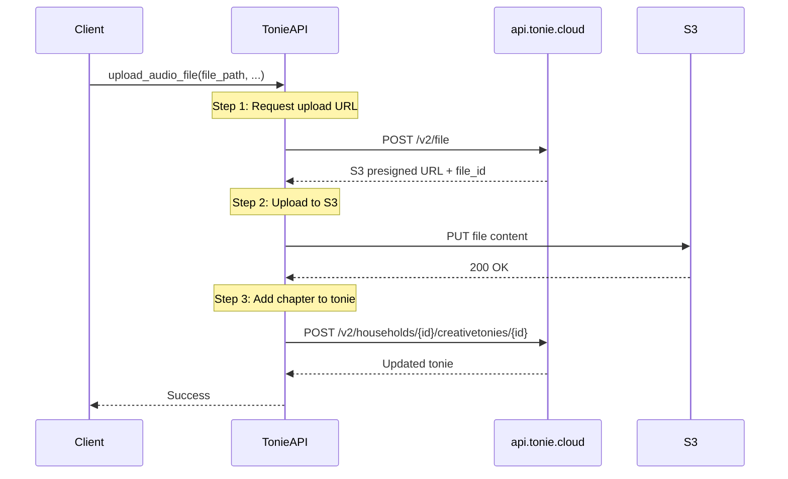

# Architecture

This document describes the internal architecture of the tonie-api library.

## Project Structure

```
src/tonie_api/
├── __init__.py          # Public exports
├── api.py               # TonieAPI: Main client class
├── session.py           # TonieCloudSession: OAuth2 authentication
├── models.py            # Pydantic v2 data models
├── exceptions.py        # Custom exception hierarchy
└── cli/
    ├── __init__.py
    ├── main.py          # CLI entry point and global options
    ├── commands.py      # All CLI commands
    └── output.py        # Table/JSON output formatting

tests/
├── test_api.py          # TonieAPI unit tests (38 tests)
├── test_models.py       # Pydantic model tests
├── test_cli.py          # CLI command tests (31 tests)
└── test_connectivity.py # API reachability tests
```

## Component Overview



## Authentication Flow

The `TonieCloudSession` class extends `requests.Session` and handles OAuth2 authentication:



**Key points:**

- Token is acquired on first API call
- Token expires after ~1 hour
- Bearer token is stored in session headers

## File Upload Flow

Uploading audio files is a three-step process:



**Implementation in `api.py`:**

1. `request_file_upload()` - Gets S3 presigned URL from API
2. `upload_to_s3()` - Uploads file directly to S3
3. `add_chapter()` - Links uploaded file to tonie as chapter

## Exception Hierarchy

```
TonieAPIError (base)
├── AuthenticationError   # 401: Invalid credentials
├── NotFoundError         # 404: Resource not found
├── RateLimitError        # 429: Too many requests
│   └── .retry_after      # Seconds to wait
├── ValidationError       # 400: Invalid input
└── ServerError           # 5xx: Server-side error
```

All exceptions include the original HTTP response for debugging.

## Data Models

Pydantic v2 models with automatic camelCase → snake_case mapping:

| Model                  | Description                                |
| ---------------------- | ------------------------------------------ |
| `User`                 | User account (email, uuid, permissions)    |
| `Config`               | Backend limits (max chapters, file size)   |
| `Household`            | Household with members and creative tonies |
| `CreativeTonie`        | Tonie with chapters and metadata           |
| `Chapter`              | Single audio chapter (id, title, duration) |
| `FileUploadRequest`    | Request body for file upload               |
| `UploadRequestDetails` | S3 presigned URL response                  |

## CLI Architecture

The CLI uses [Click](https://click.palletsprojects.com/) framework:

```
main.py
└── @click.group()
    └── Global options: --json, --debug

commands.py
├── me          # Show user info
├── households  # List households
├── tonies      # List creative tonies
├── upload      # Upload audio file
├── shuffle     # Shuffle chapters
├── clear       # Clear chapters
├── config      # Show backend limits
├── status      # API health check
├── login       # Set credentials
└── logout      # Remove credentials

output.py
├── print_table()  # Rich table output
└── print_json()   # JSON output
```

## Testing Strategy

- **Unit tests** mock HTTP responses with `responses` library
- **No live API calls** in regular test runs
- **Connectivity tests** (`test_connectivity.py`) check API reachability
- **Coverage target:** 95%+ (currently 77%)

Run tests:

```bash
poetry run pytest           # All tests
poetry run pytest -x        # Stop on first failure
poetry run pytest --cov     # With coverage report
```
